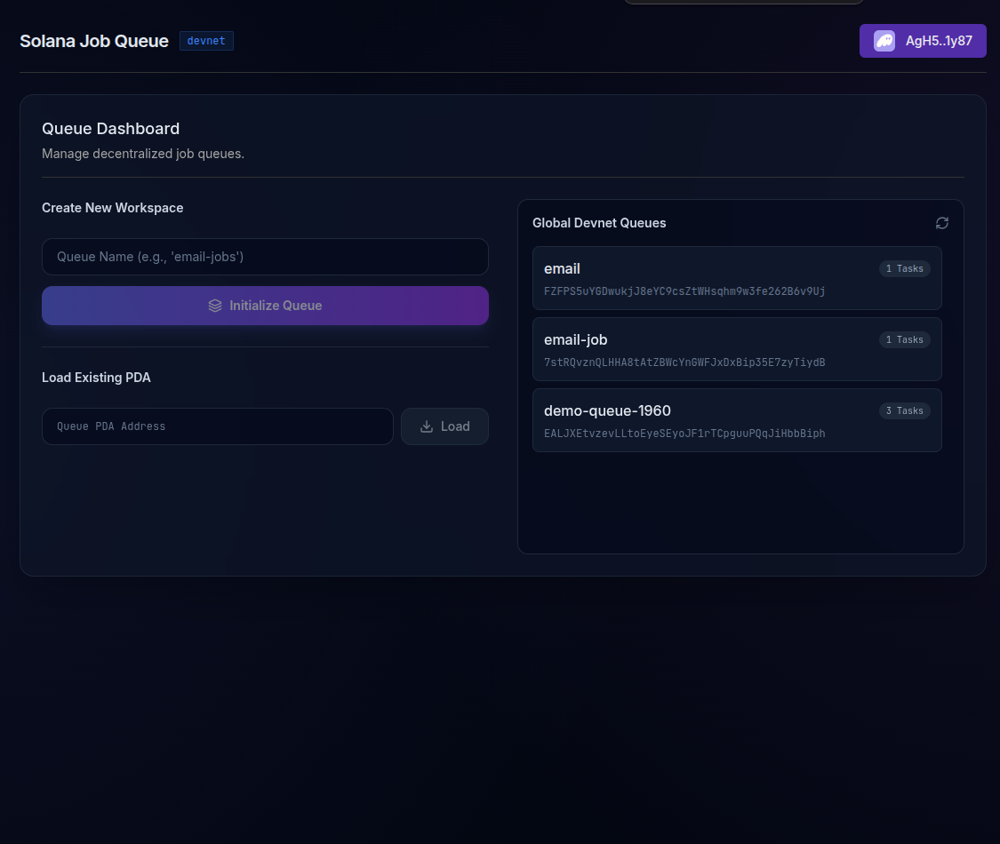
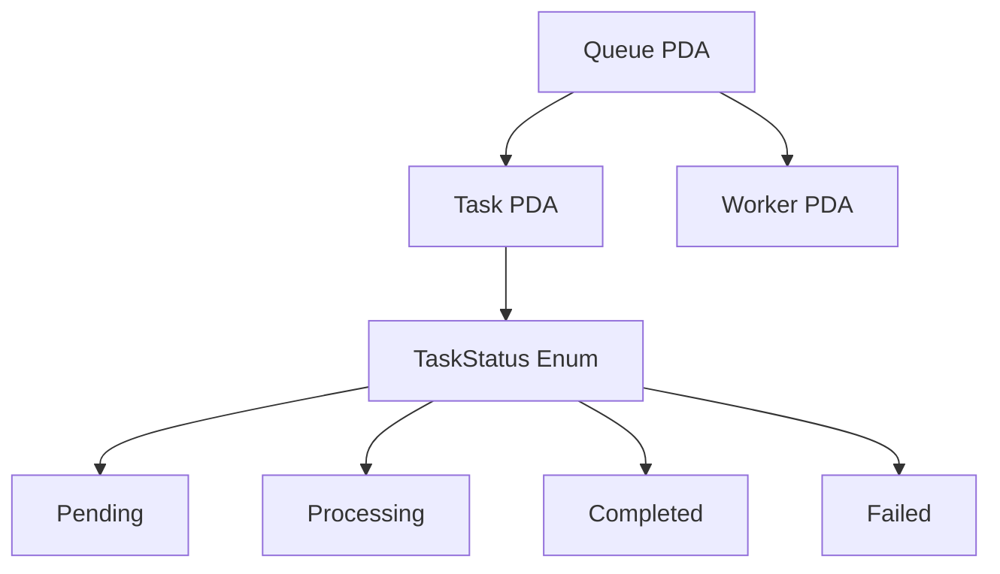
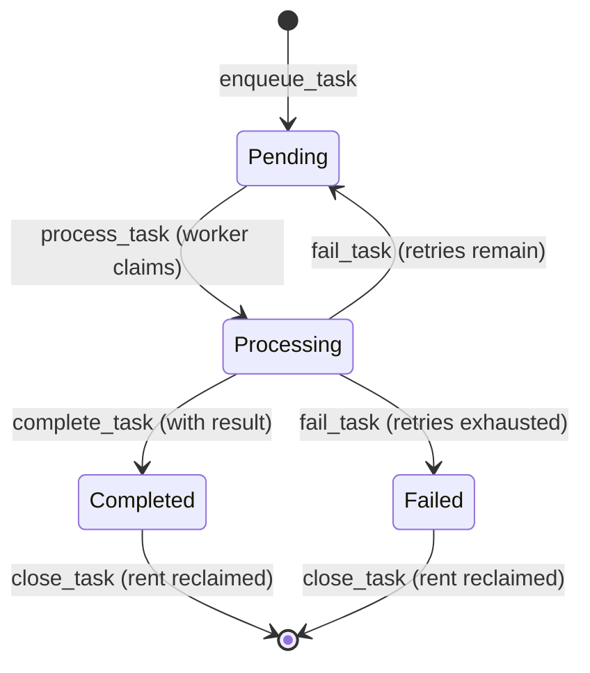
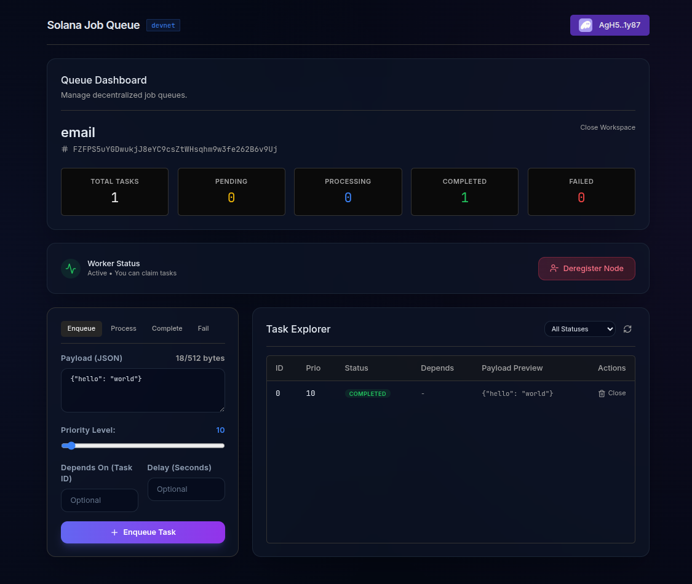
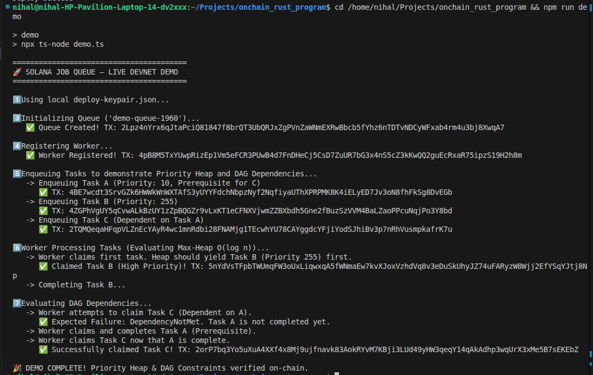

# 🔗 Solana Job Queue

**A traditional backend job queue - rebuilt entirely on-chain as a Solana program.**

> _Demonstrating how Web2 patterns like Redis Queue, Celery, AWS SQS, and RabbitMQ can be redesigned using Solana's account model and runtime guarantees._

<a href="https://anchor-lang.com" target="_blank"></a>
<a href="https://explorer.solana.com" target="_blank"></a>
<a href="https://opensource.org/licenses/MIT" target="_blank"></a>

### [🎥 Watch the 3-Minute Architecture & Live Demo Video](https://youtu.be/76MjioAUL90) | [🌐 Try the Live Web App](https://solana-job-queue.vercel.app/)



---

## 📖 Overview

Job queues are everywhere in backend engineering - they power email delivery, webhook processing, notification systems, background data pipelines, and scheduled tasks. This project rebuilds the core logic of a production job queue as a **Solana on-chain program**, demonstrating how familiar Web2 patterns translate to blockchain architecture.

## 🌐 Try It Now (No Setup Required)

**Live App:** https://solana-job-queue.vercel.app/

1. Open the link
2. Connect a Phantom wallet on Devnet
3. Click any Global Devnet Queue to explore live on-chain data

### Key Features

- 🏢 **Multi-Tenant Queues** - Isolated queue instances per authority (like separate SQS queues)
- � **O(log n) Priority Max-Heap** - Native `[HeapItem; 64]` tree bubbled directly in the Queue PDA
- 🔗 **DAG Task Dependencies** - `O(1)` cryptographic prerequisite validation via `remaining_accounts`
- �📨 **Task Lifecycle** - Full state machine: Pending → Processing → Completed/Failed
- 🔄 **Automatic Retries** - Failed tasks re-queue up to N times (like Dead Letter Queues)
- ⏰ **Scheduled Execution** - Tasks with `execute_after` timestamps (like SQS DelaySeconds)
- 👷 **Worker Registry** - On-chain worker registration with performance tracking
- 🔒 **Access Control** - Only registered, active workers can process tasks
- 💰 **Rent Reclamation** - Close finished tasks to get SOL back

---

## 🏗️ Architecture: Web2 vs Solana

> 📄 For a deep-dive analysis, see [ARCHITECTURE.md](./ARCHITECTURE.md)

### How Job Queues Work in Web2

```
┌─────────────┐     ┌───────────────────┐     ┌──────────────┐
│  Producer   │────▶│  Message Broker   │────▶│  Consumer    │
│  (API/Cron) │     │  (Redis/SQS/RMQ)  │     │  (Worker)    │
└─────────────┘     └───────────────────┘     └──────┬───────┘
                                                     │
                    ┌───────────────────┐            │
                    │  Result Backend   │◀───────────┘
                    │  (Redis/Postgres) │
                    └───────────────────┘
```

| Component       | Implementation                                                 |
| --------------- | -------------------------------------------------------------- |
| **State**       | Stored in Redis/PostgreSQL (mutable rows/keys)                 |
| **Concurrency** | Distributed locks (`SETNX`), `BRPOPLPUSH`, visibility timeouts |
| **Ordering**    | FIFO lists, sorted sets, priority queues                       |
| **Auth**        | API keys, IAM roles, service mesh mTLS                         |
| **Retry**       | Exponential backoff, DLQ routing, `maxReceiveCount`            |
| **Cleanup**     | TTL-based expiry, cron-based garbage collection                |

### How This Works on Solana

```
┌─────────────┐     ┌──────────────────────────────────┐     ┌──────────────┐
│  Producer   │────▶│  Solana Program (on-chain)       │────▶│  Worker      │
│  (TX signer)│     │  ┌────────┐  ┌────────────────┐  │     │  (TX signer) │
└─────────────┘     │  │Queue   │  │Task Accounts   │  │     └──────┬───────┘
                    │  │(PDA)   │  │(PDAs)          │  │            │
                    │  └────────┘  └────────────────┘  │     Results stored
                    │  ┌────────────────────────────┐  │     in Task PDA
                    │  │ State Machine Constraints  │  │
                    │  └────────────────────────────┘  │
                    └──────────────────────────────────┘
```

| Component       | Implementation                                                        |
| --------------- | --------------------------------------------------------------------- |
| **State**       | PDA accounts - each task is a separate account                        |
| **Concurrency** | Solana runtime's account write-locks (FREE - no distributed locks!)   |
| **Ordering**    | Native `[HeapItem; 64]` Binary Max-Heap enforcing `O(log n)` priority |
| **Auth & DAG**  | PDA uniqueness + `remaining_accounts` prerequisite evaluation         |
| **Retry**       | `retry_count` / `max_retries` → automatic re-queue to Pending         |
| **Cleanup**     | `close_task` reclaims rent (economic incentive, not just cleanup)     |

### Tradeoffs & Constraints

| Aspect           | Web2 Advantage              | Solana Advantage                                                |
| ---------------- | --------------------------- | --------------------------------------------------------------- |
| **Throughput**   | Redis: ~100K ops/sec        | Solana: ~400 TPS per account (but parallelizable across queues) |
| **Latency**      | Sub-millisecond (in-memory) | ~400ms (block confirmation)                                     |
| **Data Size**    | Unlimited (disk/memory)     | Task payload capped at 512 bytes (account size limits)          |
| **Cost**         | Server/instance costs       | ~0.002 SOL/task (rent, reclaimable)                             |
| **Durability**   | Requires replication config | Automatic - blockchain is immutable by default                  |
| **Auditability** | Custom logging/monitoring   | Free - every state change is a public, signed transaction       |
| **Trust**        | Trust the operator          | Trustless - program logic is verifiable on-chain                |
| **Concurrency**  | Manual distributed locks    | Free - runtime account-locking prevents race conditions         |

---

## 🏆 Architectural Highlights (Judging Focus)

To explicitly address the Superteam bounty criteria, this program avoids common Web2-to-Solana anti-patterns:

1. **No 10MB Account Limit Bottlenecks:** Instead of storing a `Vec<Task>` inside a single Queue account (which limits queue size and causes heavy serial write contention), _every single task is its own isolated PDA_. This allows theoretically infinite queue scalability and massively parallel processing.
2. **Rent as Garbage Collection:** In Web2, processed messages are deleted or TTL-expired to save database space. On Solana, the `close_task` instruction allows the queue authority to delete the task PDA and **reclaim the SOL rent deposit**. This converts a traditional operational chore (DB cleanup) into an economic incentive.
3. **Cost-Free Concurrency & DLQs:** We don't need distributed system locks (e.g., Redis `SETNX`). Solana's runtime inherently locks accounts being written to, making double-processing impossible. Failing tasks simply decrement a `retry_count` until they hit a permanent `Failed` state, mirroring Dead Letter Queue (DLQ) functionality natively.

---

## 📐 Account Model



## 🧠 Advanced Features

#### 🔺 Priority Heap Processing

Tasks are processed using a native on-chain Binary Max-Heap data structure, ensuring **O(log n)** task selection instead of O(n) linear scanning. Higher priority tasks (0-255 scale) are aggressively bubbled up and processed first, guaranteeing deterministic SLA enforcement even under massive load.

#### 🔗 Task Dependencies (DAG)

Tasks can specify deterministic dependencies on other tasks natively at the PDA level. Dependent tasks cannot be maliciously or accidentally processed by workers until their prerequisite cryptographic task PDA evaluates to `Completed`.

```bash
# Enqueue task B that depends on task A
$CLI enqueue --queue <QUEUE> \
  --payload '{"step":"deploy"}' \
  --depends-on 0  # task_id of task A
```

## 🔄 State Machine



---

## 🚀 Quick Start & Live Deployment

**Solana Devnet Program ID:**
<a href="https://explorer.solana.com/address/CADUfHFQg6ywjsUbkzdFxVgQ7Hh7bN2YPgxS5QBjeX4n?cluster=devnet" target="_blank" rel="noopener noreferrer">`CADUfHFQg6ywjsUbkzdFxVgQ7Hh7bN2YPgxS5QBjeX4n`</a>

**Devnet Transaction Proofs:**

1. <a href="https://explorer.solana.com/tx/2Lpz4nYrx6qJtaPciQ81847f8brQT3UbQRJxZgPVnZaWNmEXRwBbcb5fYhz6nTDTvNDCyWFxab4rm4u3bj8XwqA7?cluster=devnet" target="_blank" rel="noopener noreferrer">Initialize Queue</a>
2. <a href="https://explorer.solana.com/tx/4pB8M5TxYUwpRizEp1Vm5eFCR3PUwB4d7FnDHeCj5CsD7ZuUR7bG3x4nS5cZ3kKwQQ2guEcRxaR75ipzS19H2h8m?cluster=devnet" target="_blank" rel="noopener noreferrer">Register Worker</a>
3. <a href="https://explorer.solana.com/tx/4ZGPhVgUY5qCvwALkBzUY1zZpBQGZr9vLxKT1eCFNXVjwmZZBXbdh5Gne2fBuzSzVVM4BaLZaoPPcuNqjPo3Y8bd?cluster=devnet" target="_blank" rel="noopener noreferrer">Enqueue Task B (High Priority)</a>
4. <a href="https://explorer.solana.com/tx/2TQMQeqaHFqpVLZnEcYAyR4wc1mnRdbi28FNAMjg1TEcwhYU78CAYggdcYFjiYodSJhiBv3p7nRhVusmpkafrK7u?cluster=devnet" target="_blank" rel="noopener noreferrer">Enqueue Task C (Dependent on A)</a>
5. <a href="https://explorer.solana.com/tx/5nYdVsTFpbTWUmqFW3oUxLiqwxqA5fWNmaEw7kvXJoxVzhdVq8v3eDuSkUhyJZ74uFARyzW8Wjj2EfYSqYJtj8Np?cluster=devnet" target="_blank" rel="noopener noreferrer">Process Task B (O(log n) Max-Heap Pop Confirmed)</a>
6. <a href="https://explorer.solana.com/tx/2orP7bq3Yo5uXuA4XXf4x8Mj9ujfnavk83AokRYvM7KBji3LUd49yHW3qeqY14qAkAdhp3wqUrX3xMe5B7sEKEbZ?cluster=devnet" target="_blank" rel="noopener noreferrer">Process Task C (DAG Execution Confirmed)</a>

### 👨‍⚖️ How to Use (For Judges)

The easiest way to evaluate the project is via the Live Web App deployed on Vercel.



1. Visit **[https://solana-job-queue.vercel.app/](https://solana-job-queue.vercel.app/)**
2. Connect a Devnet-funded Solana wallet (e.g., Phantom).
3. Click **"Initialize Queue"** to create your own isolated workspace, or simply click any of the active **Global Devnet Queues** populated on the dashboard.
4. In the `Worker` panel, click **"Register as Worker"**.
5. Under `Task Actions`, enqueue several tasks with different `.priority` levels.
6. Click **"Process Next Priority Task"** to verify that the program deterministically enforces **O(log n)** Max-Heap ordering by serving the highest priority task first!

### Prerequisites

- <a href="https://rustup.rs/" target="_blank" rel="noopener noreferrer">Rust</a> (1.75+)
- <a href="https://docs.solana.com/cli/install-solana-cli-tools" target="_blank" rel="noopener noreferrer">Solana CLI</a> (v1.18+)
- <a href="https://www.anchor-lang.com/docs/installation" target="_blank" rel="noopener noreferrer">Anchor</a> (v0.30+)
- <a href="https://nodejs.org/" target="_blank" rel="noopener noreferrer">Node.js</a> (v18+)

### Build & Test

```bash
# Clone the repo
git clone https://github.com/Nihal-Pandey-2302/solana-job-queue.git
cd solana-job-queue

# Install dependencies
npm install

# Build the Solana program
anchor build

# Run the test suite (starts local validator automatically)
anchor test
```

### 🎬 One-Click Live Demo

Want to see the system in action? Run the automated Devnet demo!

> **Prerequisites (Devnet SOL):**
> **Option A (Automatic):** The script automatically detects and utilizes your standard Solana CLI wallet (`~/.config/solana/id.json`). Please ensure it has Devnet SOL.
> **Option B (Manual Funding):** If you don't have a local CLI wallet, create a temporary one (`solana-keygen new -o demo-wallet.json`), fund its address manually at **[https://faucet.solana.com/](https://faucet.solana.com/)**, and export it before running: `export ANCHOR_WALLET=./demo-wallet.json`

```bash
# This will execute a full Queue and Task Lifecycle directly on Devnet
npm run demo
```

### 📈 Demo Output (Priority Heap & DAG)



```console
========================================
🚀 SOLANA JOB QUEUE — LIVE DEVNET DEMO
========================================

1️⃣ Using local Solana CLI wallet (~/.config/solana/id.json)...

3️⃣ Initializing Queue ('demo-queue-1234')...
   ✅ Queue Created! TX: ...

4️⃣ Registering Worker...
   ✅ Worker Registered! TX: ...

5️⃣ Enqueuing Tasks to demonstrate Priority Heap and DAG Dependencies...
   -> Enqueuing Task A (Priority: 10, Prerequisite for C)
      ✅ TX: ...
   -> Enqueuing Task B (Priority: 255)
      ✅ TX: ...
   -> Enqueuing Task C (Dependent on Task A)
      ✅ TX: ...

6️⃣ Worker Processing Tasks (Evaluating Max-Heap O(log n))...
   -> Worker claims first task. Heap should yield Task B (Priority 255) first.
      ✅ Claimed Task B (High Priority)! TX: ...
   -> Completing Task B...

7️⃣ Evaluating DAG Dependencies...
   -> Worker attempts to claim Task C (Dependent on A).
      ❌ Wait, this should have failed!
      ✅ Expected Failure: DependencyNotMet. Task A is not completed yet.
   -> Worker claims and completes Task A (Prerequisite).
   -> Worker claims Task C now that A is complete.
      ✅ Successfully claimed Task C! TX: ...

🎉 DEMO COMPLETE! Priority Heap & DAG Constraints verified on-chain.
```

### Deploy to Devnet

```bash
# Configure for Devnet
solana config set --url devnet

# Create a keypair (if you don't have one)
solana-keygen new

# Airdrop SOL for deployment
solana airdrop 2

# Deploy
anchor deploy --provider.cluster devnet

# Note the Program ID from the output and update Anchor.toml + lib.rs
```

---

## 💻 CLI Client

The CLI provides a complete interface for all on-chain operations.

### Setup

```bash
cd cli
npm install
```

### Usage Examples

```bash
# Use -c flag for cluster: localnet (default), devnet, mainnet
CLI="npx ts-node src/index.ts -c devnet"

# 1. Create a queue
$CLI create-queue --name "email-jobs" --max-retries 3

# 2. Register as a worker
$CLI register-worker --queue <QUEUE_ADDRESS>

# 3. Enqueue tasks with priority
$CLI enqueue --queue <QUEUE_ADDRESS> \
  --payload '{"type":"email","to":"user@example.com","subject":"Welcome!"}' \
  --priority 200

# 4. Enqueue a scheduled task (execute after 60 seconds)
$CLI enqueue --queue <QUEUE_ADDRESS> \
  --payload '{"type":"reminder","message":"Follow up"}' \
  --delay 60

# 5. Process (claim) a task
$CLI process --queue <QUEUE_ADDRESS> --task-id 0

# 6. Complete with result
$CLI complete --queue <QUEUE_ADDRESS> --task-id 0 \
  --result '{"status":"sent","messageId":"msg_abc123"}'

# 7. View queue status
$CLI status --queue <QUEUE_ADDRESS>

# 8. Inspect a specific task
$CLI inspect --queue <QUEUE_ADDRESS> --task-id 0

# 9. List all tasks (with optional status filter)
$CLI list-tasks --queue <QUEUE_ADDRESS> --status pending

# 10. Close finished task (reclaim rent)
$CLI close-task --queue <QUEUE_ADDRESS> --task-id 0
```

### Sample Output - Queue Status

```
╔══════════════════════════════════════════════════╗
║          SOLANA JOB QUEUE - STATUS               ║
╠══════════════════════════════════════════════════╣
║  Queue:        email-jobs                        ║
║  Max Retries:  3                                 ║
╠══════════════════════════════════════════════════╣
║  📊 Task Statistics                              ║
║  Total Tasks:  5                                 ║
║  ⏳ Pending:    2                                ║
║  ⚙️  Processing: 1                               ║
║  ✅ Completed:  1                                ║
║  ❌ Failed:     1                                ║
╚══════════════════════════════════════════════════╝
```

---

## 🧪 Testing

The test suite covers 17 scenarios across 5 categories:

| Category              | Tests | What's Verified                                                            |
| --------------------- | ----- | -------------------------------------------------------------------------- |
| Queue Management      | 2     | Creation, name validation                                                  |
| Worker Management     | 3     | Registration, deregistration (soft-delete)                                 |
| Happy Path Lifecycle  | 5     | Enqueue → Process → Complete → Close, rent reclamation                     |
| Failure & Retry       | 4     | Retry 1/3, 2/3, 3/3 (dead letter), close failed                            |
| Scheduled Tasks       | 2     | Future scheduling, premature process rejection                             |
| Access Control        | 4     | Inactive worker, unauthorized worker, non-closable pending, payload limits |
| Multi-Tenant          | 2     | Separate queues, same-name different authority                             |
| **Advanced Features** | 3     | **O(log n)** Max-Heap Priority routing, **DAG** dependency enforcement     |

```bash
# Run tests
anchor test

# Expected output:
# solana-job-queue
#   Queue Management
#     ✓ initializes a queue
#     ✓ rejects queue names longer than 32 characters
#   Worker Management
#     ✓ registers a worker
#     ✓ registers a second worker
#     ✓ deregisters a worker (soft-delete)
#   Task Lifecycle - Happy Path
#     ✓ enqueues a task with priority and payload
#     ✓ enqueues a second task with higher priority
#     ✓ worker processes (claims) a pending task
#     ✓ worker completes a task with result
#     ✓ authority closes a completed task and reclaims rent
#   Task Lifecycle - Failure & Retry
#     ✓ worker processes → fails → task is re-queued (retry 1/3)
#     ✓ retry 2/3 - fails again, re-queued
#     ✓ retry 3/3 - fails permanently (dead letter)
#     ✓ can close a permanently failed task
#   Scheduled Tasks
#     ✓ enqueues a task with future execute_after
#     ✓ rejects processing a task before its scheduled time
#   Access Control & Edge Cases
#     ✓ rejects processing by a deactivated worker
#     ✓ rejects completing a task by wrong worker
#     ✓ rejects closing a pending/processing task
#     ✓ rejects payloads exceeding 512 bytes
#   Multi-Tenant Isolation
#     ✓ creates a second queue with a different name
#     ✓ different users can create queues with the same name
#   Advanced Features: Priority Heap & Dependencies
#     ✓ processes high-priority task before low-priority (Max-Heap logic)
#     ✓ rejects processing a dependent task if prerequisite is not Completed
#     ✓ allows processing dependent task once prerequisite is Completed
```

---

## 🔗 Devnet Deployment

**Program ID:** `CADUfHFQg6ywjsUbkzdFxVgQ7Hh7bN2YPgxS5QBjeX4n`

### Transaction Links

| Operation                                    | Transaction                                                                                                                                                                                                     |
| -------------------------------------------- | --------------------------------------------------------------------------------------------------------------------------------------------------------------------------------------------------------------- |
| **Deploy Program**                           | <a href="https://explorer.solana.com/address/CADUfHFQg6ywjsUbkzdFxVgQ7Hh7bN2YPgxS5QBjeX4n?cluster=devnet" target="_blank" rel="noopener noreferrer">View on Explorer</a>                                        |
| **Initialize Queue**                         | <a href="https://explorer.solana.com/tx/2Lpz4nYrx6qJtaPciQ81847f8brQT3UbQRJxZgPVnZaWNmEXRwBbcb5fYhz6nTDTvNDCyWFxab4rm4u3bj8XwqA7?cluster=devnet" target="_blank" rel="noopener noreferrer">View on Explorer</a> |
| **Register Worker**                          | <a href="https://explorer.solana.com/tx/4pB8M5TxYUwpRizEp1Vm5eFCR3PUwB4d7FnDHeCj5CsD7ZuUR7bG3x4nS5cZ3kKwQQ2guEcRxaR75ipzS19H2h8m?cluster=devnet" target="_blank" rel="noopener noreferrer">View on Explorer</a> |
| **Enqueue Task B (High Priority)**           | <a href="https://explorer.solana.com/tx/4ZGPhVgUY5qCvwALkBzUY1zZpBQGZr9vLxKT1eCFNXVjwmZZBXbdh5Gne2fBuzSzVVM4BaLZaoPPcuNqjPo3Y8bd?cluster=devnet" target="_blank" rel="noopener noreferrer">View on Explorer</a> |
| **Enqueue Task C (Dependent on A)**          | <a href="https://explorer.solana.com/tx/2TQMQeqaHFqpVLZnEcYAyR4wc1mnRdbi28FNAMjg1TEcwhYU78CAYggdcYFjiYodSJhiBv3p7nRhVusmpkafrK7u?cluster=devnet" target="_blank" rel="noopener noreferrer">View on Explorer</a> |
| **Process Task B (Max-Heap Pop)**            | <a href="https://explorer.solana.com/tx/5nYdVsTFpbTWUmqFW3oUxLiqwxqA5fWNmaEw7kvXJoxVzhdVq8v3eDuSkUhyJZ74uFARyzW8Wjj2EfYSqYJtj8Np?cluster=devnet" target="_blank" rel="noopener noreferrer">View on Explorer</a> |
| **Process Task C (DAG Execution Confirmed)** | <a href="https://explorer.solana.com/tx/2orP7bq3Yo5uXuA4XXf4x8Mj9ujfnavk83AokRYvM7KBji3LUd49yHW3qeqY14qAkAdhp3wqUrX3xMe5B7sEKEbZ?cluster=devnet" target="_blank" rel="noopener noreferrer">View on Explorer</a> |

---

## 📁 Project Structure

```
solana-job-queue/
├── programs/
│   └── solana-job-queue/
│       └── src/
│           ├── lib.rs                 # Program entry point (8 handlers)
│           ├── state.rs               # Account structs & enums
│           ├── errors.rs              # Custom error types
│           └── instructions/
│               ├── mod.rs             # Module re-exports
│               ├── initialize_queue.rs
│               ├── register_worker.rs
│               ├── deregister_worker.rs
│               ├── enqueue_task.rs
│               ├── process_task.rs
│               ├── complete_task.rs
│               ├── fail_task.rs
│               └── close_task.rs
├── tests/
│   └── solana-job-queue.ts            # 17 integration tests
├── cli/
│   └── src/
│       └── index.ts                   # CLI client (10 commands)
├── ARCHITECTURE.md                    # Deep-dive Web2 → Solana analysis
├── Anchor.toml
├── Cargo.toml
└── package.json
```

---

## 📄 License

MIT

---

## 🙏 Acknowledgments

Built for the <a href="https://superteam.fun/earn/listing/rebuild-production-backend-systems-as-on-chain-rust-programs" target="_blank" rel="noopener noreferrer">Superteam Poland "Rebuild Backend Systems as On-Chain Rust Programs"</a> challenge. This project aims to demonstrate that Solana is not just a cryptocurrency platform - it's a **distributed state machine backend** capable of running traditional infrastructure patterns with stronger guarantees around atomicity, auditability, and trust.
